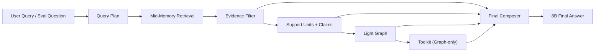

# MemSLM Architecture

This document describes the **active** MemSLM runtime.

## Active Online Path

## Stage Responsibilities

### Query Plan
- infer `intent`
- infer `answer_type`
- produce `focus_phrases`
- produce compact `sub_queries`

This stage must operate from the query itself.  
It must not use dataset `question_type` at runtime.

### Mid-Memory Retrieval
- persistent SQLite-backed retrieval
- hybrid recall over chunk and sentence units
- retrieval is optimized for recall, not final cleanliness

### Evidence Filter
- conservative denoising
- preserve answer-bearing evidence whenever possible
- retain:
  - `core_evidence`
  - `supporting_evidence`
  - `conflict_evidence`
  - limited backup windows

### Support Units and Claims
- `support_units` preserve grounded evidence fragments
- `claims` express structured facts/states/events
- the stage is designed to avoid turning evidence into an over-compressed summary

### Light Graph
- deterministic organization over claim outputs
- useful for:
  - updates
  - temporal relations
  - subject grouping
- not assumed to increase answer coverage by itself

### Toolkit
- consumes **only** light-graph output
- intended for explicit reasoning tasks such as:
  - count
  - temporal comparison
  - update resolution
- should remain narrow, inspectable, and grounded

### Final Composer
- builds the final answer prompt from:
  - filtered evidence
  - graph claims
  - light-graph summary
  - toolkit analysis
- should not reintroduce raw noisy retrieval as the main answer source

## Active Module Map

- [`/Users/rcf117/毕设/MemSLM/llm_long_memory/memory/memory_manager.py`](/Users/rcf117/毕设/MemSLM/llm_long_memory/memory/memory_manager.py)
  top-level orchestrator
- [`/Users/rcf117/毕设/MemSLM/llm_long_memory/memory/memory_manager_chat_runtime.py`](/Users/rcf117/毕设/MemSLM/llm_long_memory/memory/memory_manager_chat_runtime.py)
  chat path and final prompt composition
- [`/Users/rcf117/毕设/MemSLM/llm_long_memory/memory/evidence_candidate_extractor.py`](/Users/rcf117/毕设/MemSLM/llm_long_memory/memory/evidence_candidate_extractor.py)
  sentence-level evidence ranking and extractive candidate helpers
- [`/Users/rcf117/毕设/MemSLM/llm_long_memory/memory/answer_grounding_pipeline.py`](/Users/rcf117/毕设/MemSLM/llm_long_memory/memory/answer_grounding_pipeline.py)
  answer-grounding orchestration over evidence extraction and guard logic
- [`/Users/rcf117/毕设/MemSLM/llm_long_memory/memory/answer_response_guard.py`](/Users/rcf117/毕设/MemSLM/llm_long_memory/memory/answer_response_guard.py)
  final prompt building, answer guard checks, and answer normalization
- [`/Users/rcf117/毕设/MemSLM/llm_long_memory/memory/evidence_filter.py`](/Users/rcf117/毕设/MemSLM/llm_long_memory/memory/evidence_filter.py)
  filtering and conservative preservation
- [`/Users/rcf117/毕设/MemSLM/llm_long_memory/memory/evidence_graph_extractor.py`](/Users/rcf117/毕设/MemSLM/llm_long_memory/memory/evidence_graph_extractor.py)
  support units + claims
- [`/Users/rcf117/毕设/MemSLM/llm_long_memory/memory/evidence_light_graph.py`](/Users/rcf117/毕设/MemSLM/llm_long_memory/memory/evidence_light_graph.py)
  deterministic graph construction
- [`/Users/rcf117/毕设/MemSLM/llm_long_memory/memory/temporal_query_utils.py`](/Users/rcf117/毕设/MemSLM/llm_long_memory/memory/temporal_query_utils.py)
  shared choice/temporal parsing helpers for retrieval and graph reasoning
- [`/Users/rcf117/毕设/MemSLM/llm_long_memory/memory/graph_reasoning_toolkit.py`](/Users/rcf117/毕设/MemSLM/llm_long_memory/memory/graph_reasoning_toolkit.py)
  graph-only toolkit reasoning
- [`/Users/rcf117/毕设/MemSLM/llm_long_memory/memory/specialist_layer.py`](/Users/rcf117/毕设/MemSLM/llm_long_memory/memory/specialist_layer.py)
  toolkit orchestration

## Non-Mainline Research Code

Exploratory prototypes should not be mixed into the active runtime path.

Those modules live under:
- [`/Users/rcf117/毕设/MemSLM/llm_long_memory/future_work/README.md`](/Users/rcf117/毕设/MemSLM/llm_long_memory/future_work/README.md)

Current example:
- predictive graph cache prototype
- offline anticipated-query generation
- offline graph precomputation and strict cache lookup

These modules are preserved for research continuity, but they are not part of
the active thesis mainline unless they are explicitly promoted back into the
runtime after validation.

## Graph Visualization

The light graph is also exportable as a visualization artifact:
- combined HTML/JSON overview canvas across multiple questions

Exporter:
- [`/Users/rcf117/毕设/MemSLM/llm_long_memory/experiments/export_graph.py`](/Users/rcf117/毕设/MemSLM/llm_long_memory/experiments/export_graph.py)

## Evaluation Semantics

The repository tracks quality at multiple layers:
- `rag`
- `filter`
- `claims`
- `light_graph`
- `toolkit`
- `final_answer`
- `prompt_trace`

For analysis and plotting, metrics should be read in two views:
- overall
- by question-type group

Latency should also be tracked in two views:
- overall average latency
- per-type average latency

## Architectural Intent

This repository is intentionally not a one-shot black-box agent.

The intended research value comes from:
- making each stage explicit
- making stage failure inspectable
- preserving reproducibility under local 8B constraints
- keeping one active runtime code path clean and inspectable

## Prompt Trace Semantics

Evaluation metrics such as answer density and noise density are computed over
the final prompt trace sent to the answer model, not over raw retrieved
evidence alone.

This distinction is intentional:

- `retrieved evidence` describes what the retrieval and filtering pipeline kept
- `prompt trace` describes what the final answer model actually received

Keeping those two views separate makes failure analysis more honest and easier
to maintain.
