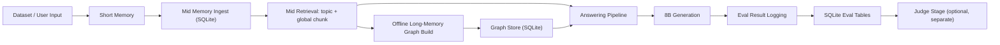

# MemSLM

MemSLM is a local, modular memory-RAG research system for long-conversation evaluation.

It is built for thesis work, but the code is organized with a stronger engineering discipline:
- clear module boundaries
- config-driven behavior
- reproducible evaluation
- separate generation and judge phases
- checkpointable experiments

The goal is not to be a production chatbot. The goal is to provide a stable, inspectable research platform for studying short memory, mid memory, and long-memory graph construction under local compute constraints.

## Motivation

Long-conversation systems fail for reasons that are easy to blur together:
- the model does not see the right context
- the retrieval layer returns the wrong evidence
- the memory representation is too coarse
- the final answer step over-trusts noisy evidence

This repository exists to separate those failure modes and make them measurable on a local machine.

The design is intentionally conservative:
- keep short-memory handling simple so immediate context remains faithful
- keep mid-memory as the main retrieval workhorse so the baseline stays fast and reproducible
- keep long-memory as a structured research module so we can inspect whether graph-style memory actually adds value
- keep generation and judge separate so answer quality, retrieval quality, and latency can be reported independently

In other words, the project is trying to answer a practical research question:
if we keep the system local and lightweight, how far can modular memory, retrieval, and graph construction go before we need heavier model reasoning?

## Core Design

The repository follows one guiding idea:

> Keep retrieval and memory construction modular, keep generation separate, and keep evaluation reproducible.

In practice this means:
- short-term memory stores recent dialogue context
- mid-term memory stores persistent conversation chunks in SQLite and performs retrieval
- long-memory stores an event-centric graph prototype for offline structural memory
- answering uses retrieved evidence plus a compact prompt to a local Ollama model
- evaluation writes every instance to SQLite so runs can be resumed and audited
- judge runs as a separate post-processing stage

## System Architecture



### What each stage does

- **Short memory**
  - holds the latest turns
  - preserves immediate conversational continuity
  - flushes old turns into mid memory when full

- **Mid memory**
  - stores conversation chunks persistently in SQLite
  - supports retrieval over topic and chunk evidence
  - serves as the main recall layer for the baseline and thesis experiments

- **Long memory**
  - builds a structured event graph from retrieved evidence
  - is evaluated offline so that graph quality can be inspected without conflating it with final answer generation
  - remains a research prototype rather than a final production module

- **Answering pipeline**
  - assembles compact evidence bundles
  - optionally uses counting / temporal / fallback helpers
  - always returns through the final model path unless explicitly turned off in an experiment

- **Evaluation**
  - writes one row per question into SQLite
  - supports interruption and resumption by `run_id`
  - can export a final report with judge-based accuracy

## Repository Layout

- `llm_long_memory/main.py`: interactive CLI entrypoint
- `llm_long_memory/config/config.yaml`: runtime configuration
- `llm_long_memory/llm/`: local Ollama client
- `llm_long_memory/memory/`: short memory, mid memory, long memory, answering pipeline, orchestration
- `llm_long_memory/evaluation/`: dataset loading, runtime evaluation, metrics, persistence, report export
- `llm_long_memory/baselines/`: frozen baseline protocol and runner
- `llm_long_memory/experiments/`: thesis-oriented subset building, split generation, judge export, graph export
- `llm_long_memory/tests/`: unit tests

### Experiment entry points

- `build_eval_subset.py`: build a compact balanced subset
- `build_eval_split.py`: build a debug/test split with a fixed manifest
- `run_thesis_eval.py`: run a thesis-oriented experiment with optional judge
- `export_eval_report.py`: export SQLite eval runs into JSON / Markdown / CSV
- `export_graph.py`: export the long-memory graph for visualization
- `llm_judge.py`: local judge helper used by the report exporter

For a more detailed breakdown of these scripts, see:
- [`llm_long_memory/experiments/README.md`](/Users/rcf117/毕设/MemSLM/llm_long_memory/experiments/README.md)

## Data Sources

The loader is designed to support:
- **LongMemEval**
- **LoCoMo**

These datasets are normalized into a shared internal shape so the same evaluation and retrieval code can be reused across benchmark families.

Recommended locations:
- LongMemEval raw files: `llm_long_memory/data/raw/LongMemEval/`
- LoCoMo raw files: `llm_long_memory/data/raw/LoCoMo/`

## Reproducibility Rules

The repo is structured around two kinds of runs:

1. **Generation run**
   - one question at a time
   - results written to SQLite immediately
   - can be resumed with `run_id`

2. **Judge run**
   - separate post-processing stage
   - batch-evaluates completed predictions
   - does not affect generation latency

This separation is intentional. It keeps generation stable and keeps the final score audit-friendly.

## Thesis Workflow

### 1) Build a debug/test split

If you want a stable development split and a frozen final split:

```bash
python -m llm_long_memory.experiments.build_eval_split \
  --source llm_long_memory/data/raw/LongMemEval/longmemeval_oracle.json \
  --debug-output llm_long_memory/data/raw/LongMemEval/longmemeval_oracle_debug.json \
  --test-output llm_long_memory/data/raw/LongMemEval/longmemeval_oracle_test.json \
  --debug-ratio 0.3 \
  --seed 42
```

Optional:
- `--keep-types`
- `--drop-types`
- `--manifest-output`

These interfaces are kept for controlled experiments, but they are not enabled by default.

### 2) Run a thesis evaluation

Example 1:

```bash
python -m llm_long_memory.experiments.run_thesis_eval \
  --config llm_long_memory/config/config.yaml \
  --dataset llm_long_memory/data/raw/LongMemEval/longmemeval_oracle_debug.json \
  --model qwen3:8b \
  --judge-model deepseek-r1:8b \
  --judge \
  --report-dir llm_long_memory/data/processed/thesis_reports
```

Example 2:

```bash
python -m llm_long_memory.experiments.run_thesis_eval \
  --config llm_long_memory/config/config.yaml \
  --dataset llm_long_memory/data/raw/LongMemEval/longmemeval_oracle_debug.json \
  --model deepseek-r1:8b \
  --judge-model qwen3:8b \
  --judge \
  --report-dir llm_long_memory/data/processed/thesis_reports
```

Useful options:
- `--resume-run-id`: resume a crashed run
- `--subset-output`: persist sampled subset
- `--keep-types` / `--drop-types`: optional type filtering
- `--max-total`, `--per-type`, `--seed`: subset control

### 3) Export a report

```bash
python -m llm_long_memory.experiments.export_eval_report \
  --db-path llm_long_memory/data/processed/mid_memory.db \
  --output-dir llm_long_memory/data/processed/thesis_reports
```

You can optionally merge offline graph evaluation JSON with:

```bash
python -m llm_long_memory.experiments.export_eval_report \
  --db-path llm_long_memory/data/processed/mid_memory.db \
  --output-dir llm_long_memory/data/processed/thesis_reports \
  --graph-json llm_long_memory/data/processed/graph_eval_*.json
```

### 4) Export the long-memory graph

```bash
python -m llm_long_memory.experiments.export_graph \
  --db-path llm_long_memory/data/processed/long_memory.db \
  --output-dir llm_long_memory/data/graphs
```

This produces graph artifacts suitable for inspection in Gephi, browser preview, or later paper figures.

## Metrics

The thesis report keeps the following metrics as the primary public contract:

- `final_answer_acc`
- `type_answer_acc`
- `retrieval_answer_span_hit_rate`
- `retrieval_support_sentence_hit_rate`
- `graph_answer_span_hit_rate`
- `graph_support_sentence_hit_rate`
- `graph_ingest_accept_rate`
- `avg_latency_sec`
- `type_latency_sec`

Interpretation:
- `final_answer_acc` is the main end-to-end answer quality metric
- `type_answer_acc` is the judge-based grouped accuracy by `question_type`
- retrieval and graph hit rates are diagnostic coverage metrics
- latency metrics measure end-to-end wall-clock answer time per question; judge time is excluded from generation latency and reported separately

## Current Experimental Policy

- Keep the main generation path stable while you tune retrieval and graph quality
- Use the debug split for iteration
- Freeze the test split for final reporting
- Keep judge separate from generation
- Prefer small, balanced experiments over full-benchmark reruns when you need fast feedback

## Branch Policy

- `main`: active development branch
- `baseline/midrag_v1`: frozen mid-memory baseline for controlled comparison

## Data and Git Hygiene

Large or runtime files are intentionally ignored:
- `llm_long_memory/data/raw/*.json`
- `llm_long_memory/data/raw/**/*.json`
- `llm_long_memory/data/processed/*.db*`
- `llm_long_memory/logs/`

Tracked placeholders keep the directory tree stable:
- `llm_long_memory/data/raw/.gitkeep`
- `llm_long_memory/data/raw/LongMemEval/.gitkeep`
- `llm_long_memory/data/raw/LoCoMo/.gitkeep`
- `llm_long_memory/data/processed/.gitkeep`
- `llm_long_memory/data/graphs/.gitkeep`

## Status

This is a research prototype with strong engineering hygiene for a thesis project.

It is not a production service, but it is now structured enough to support:
- reproducible ablations
- judge-based reporting
- checkpointable evaluation
- graph export and qualitative inspection
- baseline-versus-variant comparison

## Practical Advice

If you are about to run a new experiment:
1. Generate or select the debug split
2. Tune on debug only
3. Freeze the test split
4. Run the final judge once
5. Export the report and graph artifacts

That workflow keeps the repository both research-friendly and maintainable.
