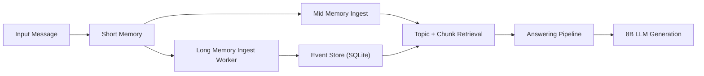

# MemSLM

MemSLM is a local, modular memory-RAG research prototype for long-conversation evaluation.

It is designed for thesis-style iteration: fast experiments, clear module boundaries, and reproducible baseline comparisons.

## What This Repo Contains
- Local LLM chat pipeline (Ollama)
- Short-term memory (context buffer)
- Mid-term memory (SQLite topic/chunk memory + hybrid retrieval)
- Early long-term memory prototype (event-centric graph-like store)
- Dataset streaming + eval persistence for LongMemEval-style workflows

## System Flow


## Branch Policy
- `main`: active development branch (current architecture evolution)
- `baseline/midrag_v1`: frozen mid-memory RAG baseline for controlled A/B

## Repo Structure
- `llm_long_memory/main.py`: CLI entry
- `llm_long_memory/config/config.yaml`: active runtime config
- `llm_long_memory/memory/`: short/mid/long memory and manager
- `llm_long_memory/evaluation/`: loader, runner, metrics, eval DB writer
- `llm_long_memory/baselines/`: baseline protocol + baseline config + runner
- `llm_long_memory/tests/`: unit tests

## 3-Minute Quick Start
```bash
python -m venv .venv
source .venv/bin/activate
pip install -r requirements.txt
python -m unittest discover -s llm_long_memory/tests -v
python llm_long_memory/main.py
```

## CLI Commands
After starting `python llm_long_memory/main.py`:
- `/run_dataset path/to/file.json`: ingest dataset messages into memory
- `/run_eval path/to/file.json`: run evaluation pipeline
- `/debug`: print memory debug stats
- `/health`: check Ollama + DB state
- `exit`: quit

## Data and Git Hygiene
Large or runtime files are intentionally ignored:
- `llm_long_memory/data/raw/*.json`
- `llm_long_memory/data/processed/*.db*`
- `llm_long_memory/logs/`

Tracked placeholders keep directory structure reproducible:
- `llm_long_memory/data/raw/.gitkeep`
- `llm_long_memory/data/processed/.gitkeep`
- `llm_long_memory/data/graphs/.gitkeep`

## Current Status
- This is a research prototype, not a production system.
- Priorities: clarity, controllable experiments, and maintainability.
- Long-memory module is under active refinement and should be evaluated against the frozen mid-RAG baseline.

## Development Notes
- Keep baseline changes out of `main` experiments unless intentionally updating protocol.
- Use small commits with one concern per commit.
- Run tests before pushing.

See also: [CONTRIBUTING.md](CONTRIBUTING.md)
