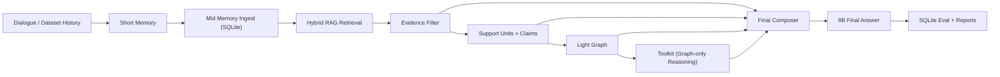

# MemSLM

MemSLM is a local, modular research harness for long-conversation memory and retrieval.

The repository is designed for thesis-grade experimentation, but the codebase is organized with an engineering-first standard:
- explicit module boundaries
- reproducible SQLite-backed evaluation
- auditable stage-wise metrics
- one active runtime path without shadow legacy branches

## Motivation

Long-conversation QA systems fail in multiple places at once:
- retrieval does not bring back the right evidence
- noisy evidence overwhelms answerable evidence
- structure extraction removes useful information while trying to clean context
- answer generation over-trusts weak cues

MemSLM exists to separate those failure modes and make them inspectable on a local machine with an 8B-class model.

The project is not trying to hide complexity behind one monolithic agent.  
It is trying to answer a more useful research question:

> If retrieval, filtering, structural extraction, graph organization, and tool use are made explicit, how far can a lightweight local system go before larger-model reasoning becomes necessary?

## Active Runtime Architecture

The active online path is now:



This matters for two reasons:
- the final model no longer consumes raw noisy retrieval directly
- each intermediate stage can be audited independently

## Design Principles

### 1. Retrieval remains the recall backbone

RAG is responsible for finding answer-bearing evidence.  
It is allowed to be noisy, but it should maximize recall.

### 2. Filtering is conservative

The filter should reduce noise without destroying rare but decisive evidence.  
It is intentionally biased toward preserving answerability.

### 3. Claims are structure, not summary

Claims should preserve grounded evidence in a structured form.  
They should not aggressively compress away information just to look cleaner.

### 4. The light graph is an organizer, not a magic oracle

The graph is meant to organize claims and expose update / temporal / subject relations.  
It is not assumed to improve answer coverage by itself.

### 5. Toolkit only reasons over graph output

The toolkit is no longer treated as a generic text-side heuristic layer.  
Its intended role is narrow and explicit:
- consume light-graph output
- perform count / temporal / update-style reasoning
- return grounded, inspectable tool results

### 6. Runtime routing cannot see dataset labels

At test time the system should not rely on dataset `question_type`.  
Routing must come from query-derived signals only:
- query plan
- answer type inferred from the query
- focus phrases
- sub-queries
- structured graph evidence

## Stage-Wise Evaluation

MemSLM tracks answer-bearing information across the active chain:
- `rag`
- `filter`
- `claims`
- `light_graph`
- `toolkit`
- `final_answer`

For audit runs, the repository records stage quality both:
- overall
- by `question_type` group for visualization and analysis

For formal evaluation, the repository records:
- `final_answer_acc`
- `type_answer_acc`
- `retrieval_answer_span_hit_rate`
- `retrieval_support_sentence_hit_rate`
- `graph_answer_span_hit_rate`
- `graph_support_sentence_hit_rate`
- `graph_ingest_accept_rate`
- `avg_latency_sec`
- `type_latency_sec`

The current interpretation of `graph_ingest_accept_rate` is tied to the active evidence-graph stack rather than the removed old event-store ingest path.

## Codebase Layout

### Active runtime modules

- [`/Users/rcf117/毕设/MemSLM/llm_long_memory/memory/memory_manager.py`](/Users/rcf117/毕设/MemSLM/llm_long_memory/memory/memory_manager.py)
  Main orchestration root.
- [`/Users/rcf117/毕设/MemSLM/llm_long_memory/memory/memory_manager_chat_runtime.py`](/Users/rcf117/毕设/MemSLM/llm_long_memory/memory/memory_manager_chat_runtime.py)
  Online answer-path runtime.
- [`/Users/rcf117/毕设/MemSLM/llm_long_memory/memory/mid_memory.py`](/Users/rcf117/毕设/MemSLM/llm_long_memory/memory/mid_memory.py)
  Mid-memory ingest and retrieval.
- [`/Users/rcf117/毕设/MemSLM/llm_long_memory/memory/evidence_filter.py`](/Users/rcf117/毕设/MemSLM/llm_long_memory/memory/evidence_filter.py)
  Conservative evidence filtering.
- [`/Users/rcf117/毕设/MemSLM/llm_long_memory/memory/evidence_candidate_extractor.py`](/Users/rcf117/毕设/MemSLM/llm_long_memory/memory/evidence_candidate_extractor.py)
  Sentence-level evidence ranking and extractive candidate helpers.
- [`/Users/rcf117/毕设/MemSLM/llm_long_memory/memory/answer_grounding_pipeline.py`](/Users/rcf117/毕设/MemSLM/llm_long_memory/memory/answer_grounding_pipeline.py)
  Answer-grounding orchestration between evidence extraction and response guard.
- [`/Users/rcf117/毕设/MemSLM/llm_long_memory/memory/answer_response_guard.py`](/Users/rcf117/毕设/MemSLM/llm_long_memory/memory/answer_response_guard.py)
  Final prompt building, guard checks, and answer normalization.
- [`/Users/rcf117/毕设/MemSLM/llm_long_memory/memory/evidence_graph_extractor.py`](/Users/rcf117/毕设/MemSLM/llm_long_memory/memory/evidence_graph_extractor.py)
  8B fixed-schema support-unit / claim extraction.
- [`/Users/rcf117/毕设/MemSLM/llm_long_memory/memory/evidence_light_graph.py`](/Users/rcf117/毕设/MemSLM/llm_long_memory/memory/evidence_light_graph.py)
  Deterministic light-graph construction.
- [`/Users/rcf117/毕设/MemSLM/llm_long_memory/memory/temporal_query_utils.py`](/Users/rcf117/毕设/MemSLM/llm_long_memory/memory/temporal_query_utils.py)
  Shared temporal and choice-query parsing helpers.
- [`/Users/rcf117/毕设/MemSLM/llm_long_memory/memory/graph_reasoning_toolkit.py`](/Users/rcf117/毕设/MemSLM/llm_long_memory/memory/graph_reasoning_toolkit.py)
  Graph-only reasoning helpers.
- [`/Users/rcf117/毕设/MemSLM/llm_long_memory/memory/specialist_layer.py`](/Users/rcf117/毕设/MemSLM/llm_long_memory/memory/specialist_layer.py)
  Toolkit orchestration layer.
- [`/Users/rcf117/毕设/MemSLM/llm_long_memory/scripts/run_answer_source_audit.py`](/Users/rcf117/毕设/MemSLM/llm_long_memory/scripts/run_answer_source_audit.py)
  Main audit entrypoint for stage-wise inspection.

## Repository Layout

- `llm_long_memory/config/`
  runtime and evaluation config
- `llm_long_memory/memory/`
  active memory / evidence / graph runtime code
- `llm_long_memory/evaluation/`
  dataset-loop evaluation, metrics, persistence
- `llm_long_memory/experiments/`
  experiment runners and report exporters
- `llm_long_memory/baselines/`
  frozen baseline protocols
- `llm_long_memory/tests/`
  unit and integration-style tests

## Main Experiment Entry Points

- `python -m llm_long_memory.experiments.run_model_only_eval`
  Bare-model baseline.
- `python -m llm_long_memory.experiments.run_naive_rag_eval`
  Textbook retrieve-then-generate baseline.
- `python -m llm_long_memory.experiments.run_ablation_eval`
  Frozen baseline / ablation protocol.
- `python -m llm_long_memory.experiments.run_thesis_eval`
  Main MemSLM evaluation entrypoint.
- `python -m llm_long_memory.experiments.run_thesis_compare`
  Consolidated comparison report from stored runs.
- `python -m llm_long_memory.scripts.run_answer_source_audit`
  Stage-wise source audit without final answer generation.

Shared experiment helpers:
- [`/Users/rcf117/毕设/MemSLM/llm_long_memory/experiments/direct_eval_runner.py`](/Users/rcf117/毕设/MemSLM/llm_long_memory/experiments/direct_eval_runner.py)
  Shared direct-baseline runner for `model-only` and `naive rag`.
- [`/Users/rcf117/毕设/MemSLM/llm_long_memory/experiments/local_llm_judge.py`](/Users/rcf117/毕设/MemSLM/llm_long_memory/experiments/local_llm_judge.py)
  Local semantic judge helper used by reports and compare flows.

## Practical Workflow

### 1. Run source audit

```bash
python -m llm_long_memory.scripts.run_answer_source_audit \
  --dataset llm_long_memory/data/raw/LongMemEval/longmemeval_ragdebug10_rebuilt.json \
  --enable-evidence-filter \
  --enable-evidence-claims \
  --enable-evidence-light-graph
```

Use this when you want to inspect:
- whether RAG found enough evidence
- whether filtering preserved answer-bearing evidence
- whether claims / graph are losing information

### 2. Run MemSLM evaluation

```bash
python -m llm_long_memory.experiments.run_thesis_eval \
  --config llm_long_memory/config/config.yaml \
  --dataset llm_long_memory/data/raw/LongMemEval/longmemeval_ragdebug10_rebuilt.json \
  --model qwen3:8b \
  --judge-model deepseek-r1:8b \
  --judge
```

### 3. Export report

```bash
python -m llm_long_memory.experiments.export_eval_report \
  --db-path llm_long_memory/data/processed/thesis_eval.db \
  --output-dir llm_long_memory/data/processed/thesis_reports_debug_analysis
```

### 4. Build consolidated comparison report

```bash
python -m llm_long_memory.experiments.run_thesis_compare \
  --config llm_long_memory/config/config.yaml \
  --split ragdebug10 \
  --model-name qwen3:8b \
  --judge-model deepseek-r1:8b
```

## Light Graph Export

The active light-graph path can be exported into one combined JSON / HTML overview:
- [`/Users/rcf117/毕设/MemSLM/llm_long_memory/experiments/export_graph.py`](/Users/rcf117/毕设/MemSLM/llm_long_memory/experiments/export_graph.py)

The exporter tiles multiple question graphs into one shared canvas for screenshots and qualitative inspection.

Example:

```bash
python -m llm_long_memory.experiments.export_graph \
  --audit-json llm_long_memory/data/processed/thesis_reports_debug_analysis/your_audit.json \
  --output-dir llm_long_memory/data/graphs_thesis_debug_analysis
```

## Current Positioning

MemSLM should be read as:
- a serious local-memory research platform
- a stage-auditable retrieval-and-structure system
- a codebase that keeps one active chain clean and inspectable

It should not be read as:
- a finished production assistant
- a single black-box agent
- a proof that graphs always outperform filtered retrieval

That distinction is deliberate. The goal is faithful research, not artificial neatness.
