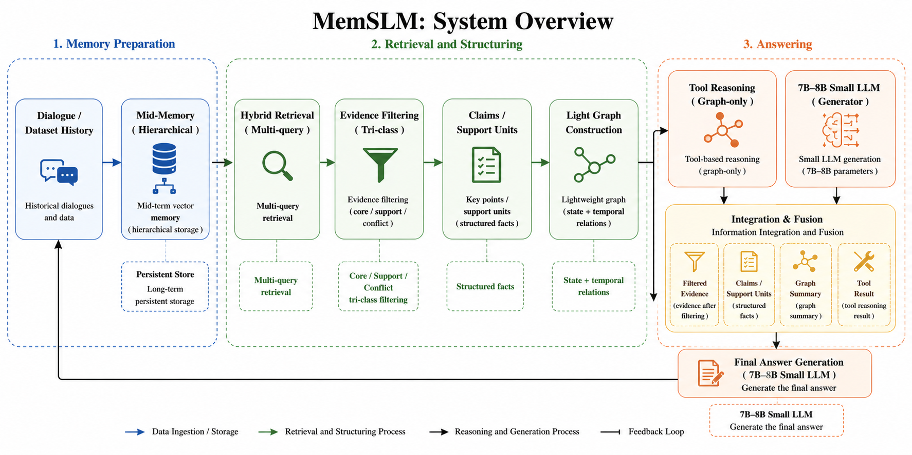
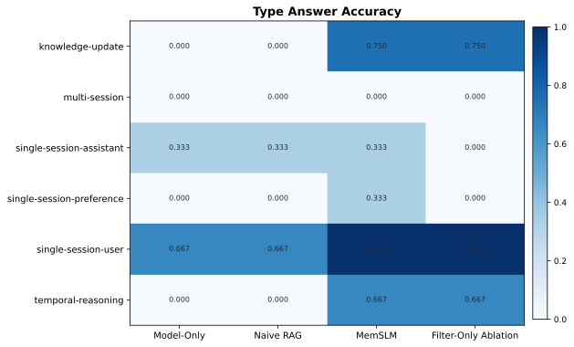
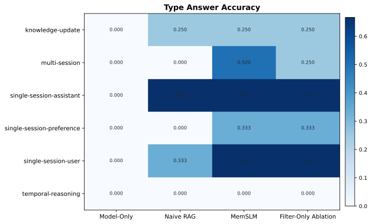
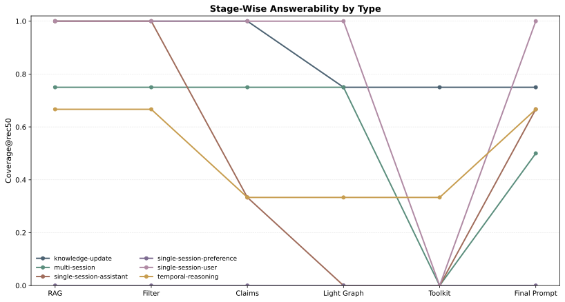
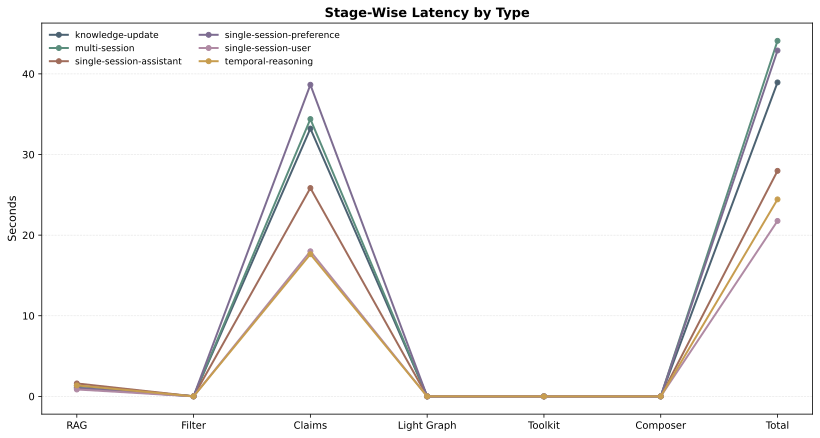
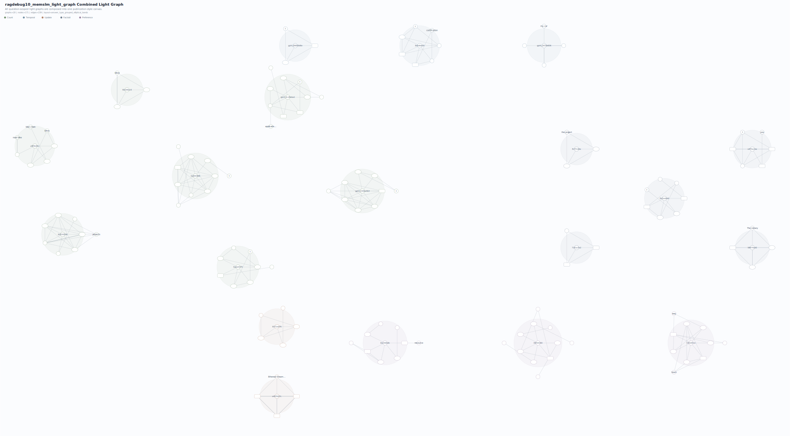

# MemSLM

MemSLM is a local, stage-auditable long-conversation QA system for studying how structured memory processing improves answer quality beyond `model-only` and `naive rag` baselines under local 8B constraints.

Under local 8B constraints, the current mainline improves judged answer accuracy from `15% -> 45%` on the `LongMemEval Diagnostic Split` and from `0% -> 30%` on the `LongMemEval Held-Out Matched Split`.

The active mainline pipeline is:

`mid retrieval -> evidence filter -> claims -> light graph -> toolkit -> final 8B answer`

This repository is organized as a research-grade engineering codebase:

- one active runtime path
- explicit stage artifacts
- reproducible evaluation runners
- stage-wise audit and visualization support
- exploratory ideas isolated under `future_work/`
- shared experiment launch helpers and stable CLI entrypoints

## Highlights

- Local 8B end-to-end QA with stage-level inspection
- Four-way evaluation protocol:
  - `model-only`
  - `naive rag`
  - `memslm`
  - `filter-only ablation`
- Two thesis splits for current mainline reporting:
  - `LongMemEval Diagnostic Split`
  - `LongMemEval Held-Out Matched Split`
- Stage-wise answerability, latency, and noise-density analysis
- Combined light-graph visualization across all questions in a split

## System Overview



Design principles:

- retrieval is recall-oriented
- filtering is conservative
- claims preserve grounded support structure
- the light graph is an organizer, not an answer oracle
- toolkit reasoning only consumes graph output
- evaluation should expose where signal is lost, not just whether the final answer is wrong

More detail:

- [ARCHITECTURE.md](ARCHITECTURE.md)
- [docs/REPRODUCIBILITY.md](docs/REPRODUCIBILITY.md)

## Main Results

All `memslm` runs below use:

- answer model: `qwen3:8b`
- judge model: `deepseek-r1:8b`

### Four-Way Comparison

#### LongMemEval Diagnostic Split

| Method | Accuracy | Avg Latency (s) | Answer Density | Noise Density |
| --- | ---: | ---: | ---: | ---: |
| `model-only` | `0.15` | `17.28` | `0.0795` | `0.9205` |
| `naive rag` | `0.10` | `17.51` | `0.0795` | `0.9205` |
| `memslm` | `0.45` | `31.29` | `0.0977` | `0.9023` |
| `filter-only ablation` | `0.15` | `6.74` | `0.1011` | `0.8989` |

#### LongMemEval Held-Out Matched Split

| Method | Accuracy | Avg Latency (s) | Answer Density | Noise Density |
| --- | ---: | ---: | ---: | ---: |
| `model-only` | `0.00` | `21.76` | `0.0256` | `0.9744` |
| `naive rag` | `0.10` | `20.76` | `0.0404` | `0.9596` |
| `memslm` | `0.30` | `35.52` | `0.0593` | `0.9407` |
| `filter-only ablation` | `0.15` | `6.90` | `0.0561` | `0.9439` |

Interpretation:

- `memslm` is the strongest system on both splits
- `filter-only ablation` is the fastest mainline-compatible ablation
- the held-out split is materially harder than the diagnostic split

Detailed reports:

- [Diagnostic comparison report](llm_long_memory/data/processed/thesis_reports_debug_analysis/LongMemEval_Diagnostic_Split__model-qwen3_8b__judge-deepseek-r1_8b__memslm-centered_comparison.md)
- [Held-out comparison report](llm_long_memory/data/processed/thesis_reports_debug_analysis/LongMemEval_Held-Out_Matched_Split__model-qwen3_8b__judge-deepseek-r1_8b__memslm-centered_comparison.md)
- [Extended results index, including per-type tables](docs/RESULTS.md)

## Extension Generalization Checks

These runs are not part of the core two-split, four-way comparison grid above. They are intended as external-validity checks for robustness under changed evaluation conditions.

### Swapped Answer/Judge Roles

Setup:

- answer model: `deepseek-r1:8b`
- judge model: `qwen3:8b`
- split: `LongMemEval Held-Out Matched Split`

Result:

- `final_answer_acc = 0.30`
- `avg_latency_sec = 36.08`

Artifacts:

- [Swapped-role report](llm_long_memory/data/processed/thesis_reports_debug_analysis/run_20260426_103908_dc8d2874__longmemeval_eval_subset_matched_to_diagnostic_split__model-deepseek-r1_8b__judge-qwen3_8b_report.md)

Interpretation:

- the framework still runs coherently when the answer model and judge model are exchanged
- this check supports robustness of the evaluation setup, but does not outperform the main `qwen3:8b -> deepseek-r1:8b` configuration

### LoCoMo External-Dataset Check

Setup:

- split: `LoCoMo Matched-Distribution 20-QA Subset`
- answer model: `qwen3:8b`
- judge model: `deepseek-r1:8b`

Results:

| Method | Accuracy | Avg Latency (s) |
| --- | ---: | ---: |
| `model-only` | `0.05` | `21.34` |
| `memslm` | `0.15` | `42.04` |

Artifacts:

- [LoCoMo model-only report](llm_long_memory/data/processed/thesis_reports_debug_analysis/locomo_model_only_matched20_report.md)
- [LoCoMo report](llm_long_memory/data/processed/thesis_reports_debug_analysis/run_20260426_113651_62a381bc__locomo20_matched_distribution__model-qwen3_8b__judge-deepseek-r1_8b_report.md)

Interpretation:

- the pipeline transfers across dataset format and domain without code-path replacement
- `memslm` still improves over `model-only` on the external dataset
- performance is materially lower than on LongMemEval, so this run should be read as a stress-test for external generalization rather than a headline benchmark

## Core Visualizations

### Per-Type Accuracy Heatmaps

<p align="center">
  
  
</p>

These heatmaps give the quickest type-level comparison across the four evaluation settings:

- `memslm` is strongest on `knowledge-update` and `single-session-user` in the diagnostic split
- the held-out split remains harder overall, but `memslm` still improves on `multi-session`, `single-session-preference`, and `single-session-user`

### Stage-Wise Analysis

<p align="center">
  
  
</p>

These figures are the most useful stage-wise diagnostics in the current thesis workflow because they show both:

- where answer-bearing signal survives across stages
- where the runtime cost concentrates across question types

### Light-Graph Overview

<p align="center">
  
</p>

The light graph is strongest as:

- an intermediate structural representation
- a debugging surface
- a compact summary of support relations across questions

It should not be interpreted as a standalone answer engine.

## Repository Layout

```text
llm_long_memory/
  config/         Runtime and evaluation configuration
  evaluation/     Eval loops, metrics, reporting, SQLite persistence
  experiments/    Main experiment runners and exporters
  future_work/    Isolated exploratory prototypes
  llm/            Local LLM wrappers
  memory/         Active mainline runtime path
  scripts/        Audit and utility entrypoints
  tests/          Unit and integration-style tests
  utils/          Shared helpers
docs/
  assets/         Stable figures referenced by repository documentation
```

Important boundary:

- `llm_long_memory/memory/` is the active runtime
- `llm_long_memory/experiments/` is the active evaluation/reporting surface
- `llm_long_memory/future_work/` is intentionally isolated from the mainline

## Installation

### 1. Create an environment

```bash
python3 -m venv .venv
source .venv/bin/activate
pip install -r requirements.txt
```

### 2. Make sure local Ollama models are available

Mainline experiments assume local Ollama-compatible models such as:

- `qwen3:8b`
- `deepseek-r1:8b`
- `nomic-embed-text`

Runtime configuration:

- [config.yaml](llm_long_memory/config/config.yaml)

## Maintenance Shortcuts

For everyday repository maintenance:

```bash
make compile
make test
make eval-memslm SPLIT=longmemeval_diagnostic
```

The complete paper-facing reproduction protocol is documented in:

- [docs/REPRODUCIBILITY.md](docs/REPRODUCIBILITY.md)

## Running the Main Experiments

### MemSLM

```bash
python3 -m llm_long_memory.experiments.run_thesis_eval \
  --config llm_long_memory/config/config.yaml \
  --split longmemeval_diagnostic \
  --model qwen3:8b \
  --judge \
  --judge-model deepseek-r1:8b
```

### Model-Only

```bash
python3 -m llm_long_memory.experiments.run_model_only_eval \
  --config llm_long_memory/config/config.yaml \
  --split longmemeval_diagnostic \
  --model qwen3:8b
```

### Naive RAG

```bash
python3 -m llm_long_memory.experiments.run_naive_rag_eval \
  --config llm_long_memory/config/config.yaml \
  --split longmemeval_diagnostic \
  --model qwen3:8b
```

### Filter-Only Ablation

```bash
python3 -m llm_long_memory.experiments.run_ablation_eval \
  --config llm_long_memory/config/config.yaml \
  --split longmemeval_diagnostic \
  --model qwen3:8b
```

### Consolidated Comparison

```bash
python3 -m llm_long_memory.experiments.run_thesis_compare \
  --config llm_long_memory/config/config.yaml \
  --split longmemeval_diagnostic \
  --judge \
  --judge-model deepseek-r1:8b \
  --model-only-run-id <run_id> \
  --naive-rag-run-id <run_id> \
  --memslm-run-id <run_id> \
  --ablation-run-id <run_id>
```

### Source Audit and Light-Graph Export

```bash
PYTHONPATH=. python3 llm_long_memory/scripts/run_answer_source_audit.py \
  --config llm_long_memory/config/config.yaml \
  --dataset llm_long_memory/data/raw/LongMemEval/longmemeval_ragdebug10_rebuilt.json \
  --output-dir llm_long_memory/data/processed/thesis_reports_debug_analysis \
  --output-prefix answer_source_audit_longmemeval_diagnostic_memslm \
  --enable-evidence-filter \
  --enable-evidence-claims \
  --enable-evidence-light-graph

python3 -m llm_long_memory.experiments.export_graph \
  --audit-json <audit_json_path> \
  --output-dir llm_long_memory/data/graphs_thesis_debug_analysis \
  --artifact-prefix longmemeval_diagnostic_memslm_light_graph
```

More experiment entry points:

- [llm_long_memory/experiments/README.md](llm_long_memory/experiments/README.md)

## Thesis Asset Checklist

For paper-ready tables, figures, captions, and source paths:

- [docs/THESIS_ASSET_CHECKLIST.md](docs/THESIS_ASSET_CHECKLIST.md)

## Ongoing Generalization Checks

Two additional experiments are intentionally kept outside the current two-split main comparison:

- swapping the answer model and judge model roles between `qwen3:8b` and `deepseek-r1:8b`
- evaluating the framework on `LoCoMo`

These are intended as generalization checks rather than part of the main thesis comparison grid.

## Scope and Non-Goals

MemSLM should be read as:

- a local-memory research platform
- a stage-auditable retrieval-and-structure system
- a thesis-grade codebase focused on reproducibility and diagnosis

It should not be read as:

- a production assistant
- a fully self-improving learning system
- a proof that graph structure always dominates filtered retrieval

## Future Work

Exploratory modules and negative-result directions are preserved under:

- [llm_long_memory/future_work/README.md](llm_long_memory/future_work/README.md)

This keeps the mainline stable while preserving research continuity.
