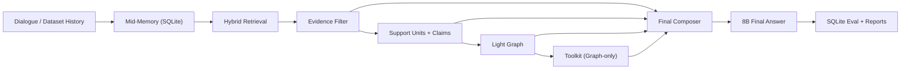
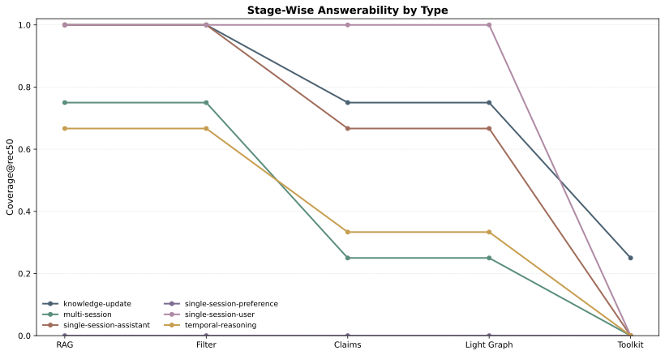
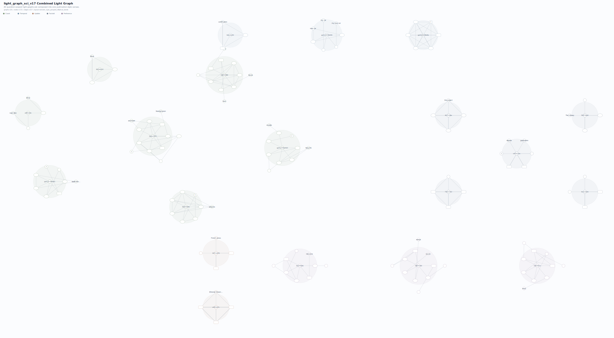

# MemSLM

MemSLM is a local, stage-auditable long-conversation QA system for studying how far a lightweight memory stack can go before larger-model reasoning becomes necessary.

Instead of treating memory QA as a single black-box step, MemSLM makes each stage explicit:

- hybrid retrieval
- conservative evidence filtering
- support-unit / claim extraction
- light-graph organization
- graph-only toolkit reasoning
- final answer generation with a local 8B model

The repository is designed for thesis-grade experimentation, but organized to keep one active runtime path clean and inspectable.

## Why This Repository Exists

Long-context QA systems often fail for different reasons at different layers:

- retrieval misses answer-bearing evidence
- noisy evidence overwhelms the useful part
- structural extraction removes information while trying to clean context
- final generation over-trusts weak cues

MemSLM separates those failure modes so they can be measured, visualized, and debugged independently on a local machine.

## System Overview



Design principles:

- retrieval is recall-oriented
- filtering is conservative
- claims preserve grounded structure rather than over-compressing evidence
- the light graph is an organizer, not a magic oracle
- the toolkit consumes graph output only
- one active runtime path is preferred over multiple hidden legacy branches

More detail: [ARCHITECTURE.md](ARCHITECTURE.md)

## Current Mainline Result

The current mainline repository keeps a stable `45%` judged accuracy result on the local `ragdebug10` diagnostic split using a local 8B answer model.

Snapshot:

| Setting | Value |
| --- | --- |
| Dataset | `longmemeval_ragdebug10_rebuilt.json` |
| Main answer model | `qwen3:8b` |
| Judge model | `deepseek-r1:8b` |
| Judged final accuracy | `45.0%` |
| Exact match | `25.0%` |
| Average latency | `33.65s` |
| Retrieval answer-span hit rate | `40.0%` |
| Light-graph answer-span hit rate | `40.0%` |

Reference run:
- `run_20260425_150142_207e3577`

Detailed tables and notes:
- [docs/RESULTS.md](docs/RESULTS.md)

## Example Figures

### Stage Answerability by Question Type



### Combined Light-Graph Visualization



## Repository Layout

```text
llm_long_memory/
  baselines/      Frozen baseline protocols
  config/         Runtime and evaluation config
  evaluation/     Eval loops, metrics, SQLite persistence
  experiments/    Main experiment runners and report exporters
  future_work/    Isolated exploratory prototypes
  llm/            Local LLM wrappers
  memory/         Active runtime path
  scripts/        Audit and utility entrypoints
  tests/          Unit and integration-style tests
  utils/          Shared helpers
docs/
  assets/         Tracked figures used in repository docs
```

Important boundary:

- `llm_long_memory/memory/` is the active mainline runtime
- `llm_long_memory/experiments/` is the active evaluation/reporting surface
- `llm_long_memory/future_work/` contains research prototypes that are intentionally not part of the main runtime

## Installation

### 1. Create an environment

```bash
python3 -m venv .venv
source .venv/bin/activate
pip install -r requirements.txt
```

### 2. Make sure local Ollama models are available

Mainline experiments assume local Ollama-compatible models such as:

- `qwen3:8b`
- `deepseek-r1:8b`

Configure the runtime in:
- [`llm_long_memory/config/config.yaml`](llm_long_memory/config/config.yaml)

## Quick Start

### Interactive runtime

```bash
python -m llm_long_memory.main \
  --config llm_long_memory/config/config.yaml \
  --model qwen3:8b
```

### Source audit without final answer generation

```bash
python -m llm_long_memory.scripts.run_answer_source_audit \
  --dataset llm_long_memory/data/raw/LongMemEval/longmemeval_ragdebug10_rebuilt.json \
  --enable-evidence-filter \
  --enable-evidence-claims \
  --enable-evidence-light-graph
```

### Main MemSLM evaluation

```bash
python -m llm_long_memory.experiments.run_thesis_eval \
  --config llm_long_memory/config/config.yaml \
  --dataset llm_long_memory/data/raw/LongMemEval/longmemeval_ragdebug10_rebuilt.json \
  --model qwen3:8b \
  --judge-model deepseek-r1:8b \
  --judge
```

### Baselines

```bash
python -m llm_long_memory.experiments.run_model_only_eval --config llm_long_memory/config/config.yaml
python -m llm_long_memory.experiments.run_naive_rag_eval --config llm_long_memory/config/config.yaml
```

## Experiment and Reporting Entry Points

Main entry points:

- `python -m llm_long_memory.experiments.run_thesis_eval`
- `python -m llm_long_memory.experiments.run_model_only_eval`
- `python -m llm_long_memory.experiments.run_naive_rag_eval`
- `python -m llm_long_memory.experiments.run_ablation_eval`
- `python -m llm_long_memory.experiments.run_thesis_compare`
- `python -m llm_long_memory.experiments.export_eval_report`
- `python -m llm_long_memory.experiments.render_thesis_visuals`
- `python -m llm_long_memory.experiments.export_graph`

Experiment-specific notes:
- [llm_long_memory/experiments/README.md](llm_long_memory/experiments/README.md)

## What Is In Scope

MemSLM should be read as:

- a local-memory research platform
- a stage-auditable retrieval-and-structure system
- a codebase optimized for reproducibility and diagnosis under local 8B constraints

It should not be read as:

- a finished production assistant
- a single black-box agent
- a proof that graph structure always dominates filtered retrieval

## Future Work

Exploratory ideas that are not part of the current mainline are kept under:

- [llm_long_memory/future_work/README.md](llm_long_memory/future_work/README.md)

Current example:

- predictive graph cache prototype

These modules are preserved for research continuity, but intentionally isolated until they demonstrate clear accuracy or latency value.
